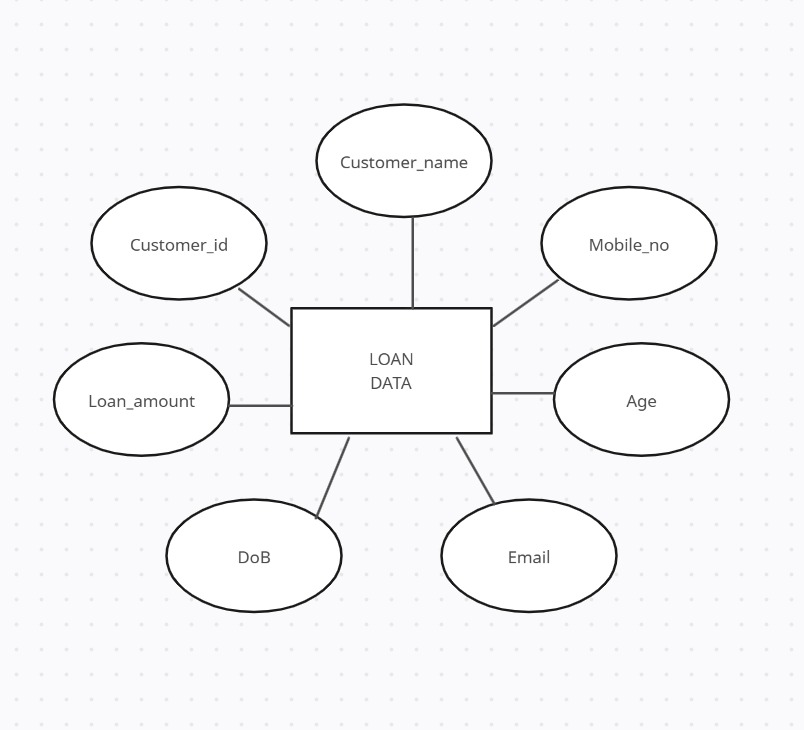

# Ex02 Django ORM Web Application
## Date: 14.11.24

## AIM
To develop a Django application to store and retrieve data from a bank loan database using Object Relational Mapping(ORM).

## ENTITY RELATIONSHIP DIAGRAM

## DESIGN STEPS

### STEP 1:
Clone the problem from GitHub

### STEP 2:
Create a new app in Django project

### STEP 3:
Enter the code for admin.py and models.py

### STEP 4:
Execute Django admin and create details for 10 books

## PROGRAM
'''
from django.db import models
from django.contrib import admin
class Loan (models.Model):
    Customer_id=models.CharField(max_length=20, primary_key=True)
    Customer_name=models.CharField(max_length=100)
    Mobile_no=models.IntegerField( )
    Age=models.IntegerField( )
    Email=models.EmailField( )
    DoB=models.DateField( )
    Loan_amount=models.IntegerField( )
class LoanAdmin(admin.ModelAdmin):
    	list_display=('Customer_id', 'Customer_name', 'Mobile_no', 'Age', 'Email','DoB', 'Loan_amount')
'''

## OUTPUT

## RESULT
Thus the program for creating a database using ORM hass been executed successfully
